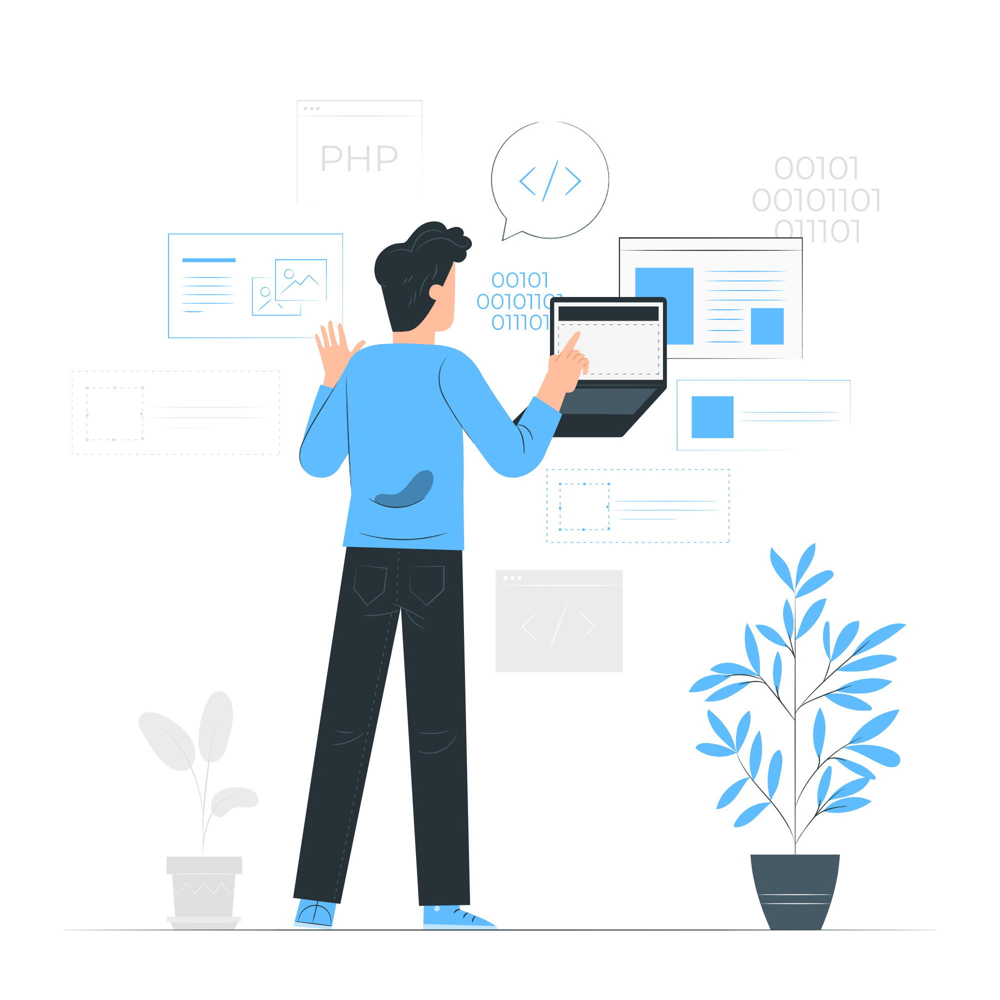

# About me

_“Success is the sum of small efforts, repeated day after day.”_
 

I'm a front-end developer passionate about what I do, creating interfaces for me is an adventure, and every day I try to specialize myself more and more.
 

Main skills: ReactJS, Next.js, Typescript, Context API, Hooks, Chakra UI, Material UI, Unform, React Hook Form, Moment, Styled Components, Tailwind CSS, Bootstrap, ApexCharts.

💬 Hobbies: Cycling, games and good musics.

 

 

  <a href="https://github.com/MarcusSantos37">

  

  
<strong>Contact me!</strong>

 

    
    
  

